# Dog Emotion Classifier — Architecture Plan

## Assumed Data

We assume the following data is available for training:

| Asset | Details |
|-------|---------|
| **Raw images** | Dog images extracted as keyframes from video |
| **Emotion labels** | Each image has a corresponding emotion class label (e.g., happy, relaxed, anxious, aggressive) |
| **DLC keypoints** | 19 body part coordinates per image, extracted via DeepLabCut SuperAnimal HRNet-W32 |
| **Keypoint list** | right_eye, left_eye, nose, top_head, right_ear_base, left_ear_base, neck, right_front_wrist, right_front_paw, left_front_wrist, left_front_paw, whithers, spine_1, spine_2, tail_tip, left_back_wrist, left_back_paw, right_back_wrist, right_back_paw |
| **DLC inference pipeline** | Working backend (FastAPI + GCP Cloud Run) to extract keypoints from new videos |

### Data Characteristics & Known Issues

- **Missing keypoints:** Many images have NaN values for occluded body parts (partial views, limbs out of frame)
- **Coordinate format:** Currently `(x, y)` per keypoint. DLC also outputs a confidence/likelihood score `(p)` — this should be preserved in the data pipeline as it is valuable for all pose-based models
- **Image sources:** Dog cameras (Furbo), YouTube compilations — predominantly indoor pet footage
- **No temporal data:** Keypoints are per-frame, not stored as sequences across consecutive frames

---

## End-to-End Pipeline Overview

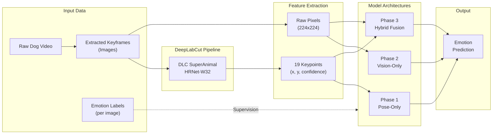

## Dog Skeleton Graph (19 Keypoints)

This graph defines the anatomical connections used by the GCN architecture:

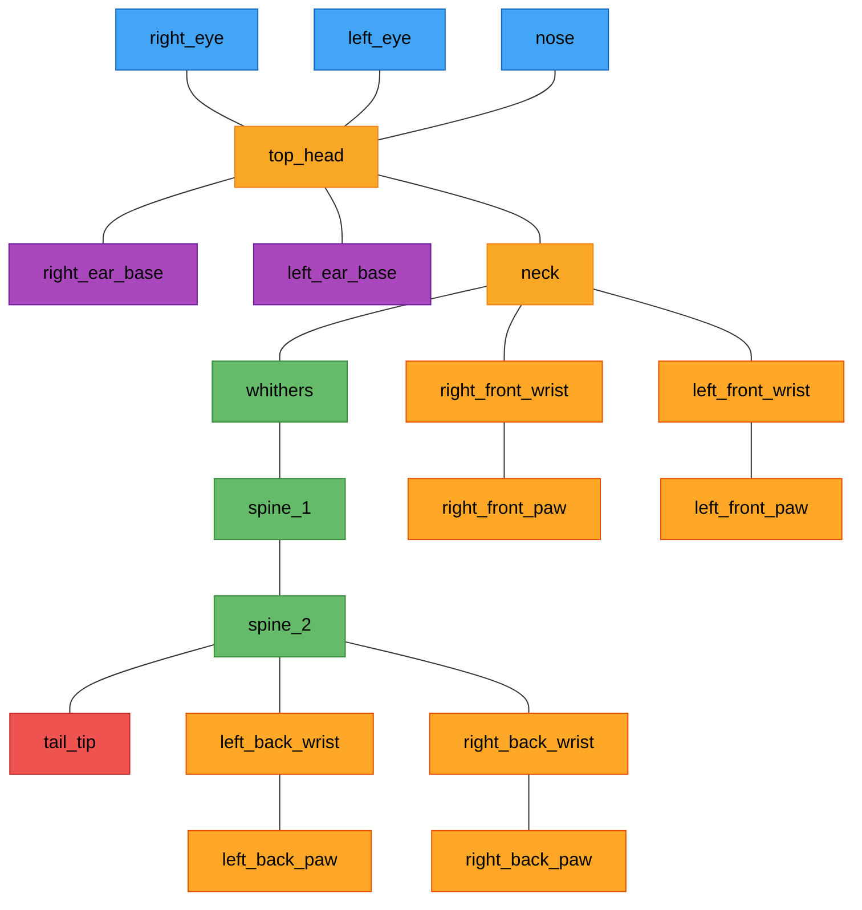

> **Color key:** Blue = face, Purple = ears, Yellow = head/neck hub, Green = spine, Red = tail, Orange = limbs

---

## Architectures We Can Build

Given images + emotion labels + keypoints, we can build all 5 architectures below. They are ordered from simplest to most complex — each phase builds on insights from the previous one.

---

## Phase 1: Pose-Only Architectures

These models ignore raw pixels entirely and train only on the `(x, y)` keypoint coordinates. They are fast to train (seconds to minutes), lightweight, and serve as the critical first test: **do the keypoints alone carry enough signal to predict emotion?**

### Architecture 1: Deep MLP (Multi-Layer Perceptron)

**Role:** Absolute baseline. If this can't beat random chance, keypoints alone are insufficient.

**Input:** Flatten all keypoint coordinates into a single 1D vector.
- With confidence scores: `(19 keypoints × 3 values)` = 57 features per image
- Without confidence scores: `(19 keypoints × 2 values)` = 38 features per image

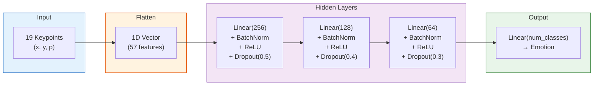

**Preprocessing required:**
- **Normalize coordinates** to [0, 1] relative to image dimensions or dog bounding box — this makes the model invariant to image resolution
- **Handle missing keypoints (NaNs):** Options ranked by quality:
  1. Zero-fill + binary visibility mask (add 19 extra features indicating which keypoints are visible)
  2. Mean imputation from training set
  3. Simple zero-fill
- **Data augmentation:** Horizontal flip (swap left/right keypoint pairs), small random rotation, scale jitter

**Data requirement:** ~200–500 labeled samples per emotion class.

**What it tells you:**
- If accuracy >> random chance → keypoints encode emotion, proceed to GCN
- If accuracy ≈ random chance → keypoints alone aren't enough, vision features are essential

**Strengths:** Trains in seconds, fully interpretable (feature importance analysis possible), no GPU required.

**Limitations:** Treats keypoints as an unstructured flat vector — ignores the spatial skeleton topology. A misplaced nose and a misplaced tail contribute equally.

---

### Architecture 2: Graph Convolutional Network (GCN)

**Role:** Spatially-aware pose model. Understands that the tail connects to the spine, not to the ear.

**Input:**
- Node features: `(19, 3)` matrix — each keypoint is a node with features `(x, y, confidence)`
- Edge index: defined by the dog skeleton (anatomical connections)

**Skeleton edges (adjacency definition):**
```python
skeleton_edges = [
    ("right_eye", "top_head"),
    ("left_eye", "top_head"),
    ("nose", "top_head"),
    ("top_head", "right_ear_base"),
    ("top_head", "left_ear_base"),
    ("top_head", "neck"),
    ("neck", "whithers"),
    ("whithers", "spine_1"),
    ("spine_1", "spine_2"),
    ("spine_2", "tail_tip"),
    ("neck", "right_front_wrist"),
    ("neck", "left_front_wrist"),
    ("right_front_wrist", "right_front_paw"),
    ("left_front_wrist", "left_front_paw"),
    ("spine_2", "left_back_wrist"),
    ("spine_2", "right_back_wrist"),
    ("left_back_wrist", "left_back_paw"),
    ("right_back_wrist", "right_back_paw"),
]
```

**Architecture (PyTorch Geometric):**

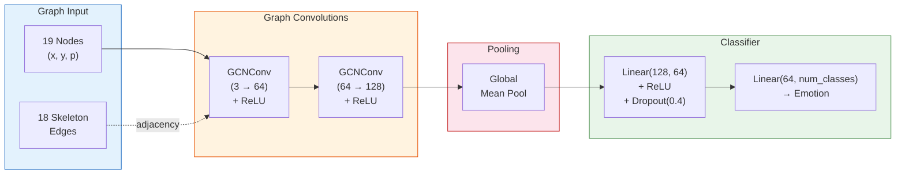

**Data requirement:** ~200–500 labeled samples per class (same as MLP — pose-only models are data-efficient).

**Strengths:**
- Learns spatial relationships: tail-to-spine angle, ear-to-head offset, leg posture symmetry
- More invariant to global position and scale (learns relative geometry between connected joints)
- Typically generalizes better than MLP with less data

**Limitations:**
- Requires PyTorch Geometric as a dependency
- Only 19 nodes — the graph is small, so the advantage over MLP may be marginal in practice
- Single-frame only — misses temporal dynamics (wagging speed, trembling)
- Missing keypoints break the graph structure (need to handle absent nodes)

**Extension — Spatio-Temporal GCN (ST-GCN):**
If you later store keypoint sequences across consecutive video frames (e.g., 30 frames at a time), ST-GCN can capture both body structure *and* motion over time. This is significantly more powerful for emotion detection since many emotions are expressed through movement patterns (tail wagging frequency, pacing, freezing). This requires modifying the data pipeline to output temporal keypoint sequences rather than isolated per-frame data.

---

## Phase 2: Vision-Only Architectures

These models learn from raw image pixels. They can capture visual cues that keypoints completely miss: raised fur (hackles), dilated pupils, whale eye, lip licking, mouth tension, ear orientation details, and environmental context (interaction with toys vs. cowering under furniture).

### Architecture 3: EfficientNet Transfer Learning

**Role:** Strong vision baseline. Current gold standard for image classification tasks with limited data.

**Input:** Raw image resized to 224×224 (B0) or 260×260 (B1).

**Architecture:**

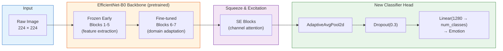

**Training strategy:**
1. **Stage 1 (5–10 epochs):** Freeze entire backbone, train only the new classifier head. Learning rate: 1e-3.
2. **Stage 2 (20–50 epochs):** Unfreeze last 2 blocks, fine-tune end-to-end. Learning rate: 1e-4 with cosine annealing.

**Data requirement:** ~500–1,000 labeled samples per class (transfer learning reduces the need for massive datasets).

**Preprocessing:**
- Resize and center-crop to model input size
- ImageNet normalization (mean=[0.485, 0.456, 0.406], std=[0.229, 0.224, 0.225])
- Augmentation: random horizontal flip, color jitter, random rotation (±15°), random erasing

**Strengths:**
- Captures rich visual features invisible to keypoints
- Squeeze-and-Excitation blocks help the network focus on the most relevant image regions
- Pre-trained weights give a massive head start — the model already understands edges, textures, and shapes
- Computationally efficient for its accuracy (designed for mobile/edge deployment)

**Limitations:**
- Can overfit to background, lighting, or camera type instead of the dog's actual emotional state
- Less interpretable — hard to know exactly which pixels drove a prediction
- Requires GPU for reasonable training time
- Sensitive to image quality and resolution variations

**Alternatives worth trying:**
- **ResNet-50:** Simpler architecture, well-understood, slightly less accurate but easier to debug
- **ConvNeXt-Tiny:** Modern pure-CNN architecture, strong performance, good torchvision support
- **Vision Transformer (ViT-B/16):** Attention-based, can be more expressive but needs more data

---

### Architecture 4: Keypoint-Guided Crop CNN (The "Zoom-In" Method)

**Role:** Use DLC keypoints to intelligently crop the most emotionally expressive regions, then classify from those crops.

**Concept:** Instead of feeding the entire image (which includes irrelevant background), use keypoint coordinates to extract tight crops around:
- **Face region:** Bounding box around right_eye, left_eye, nose, top_head, right_ear_base, left_ear_base
- **Tail region:** Bounding box around spine_2 and tail_tip
- **Full body crop (optional):** Bounding box around all visible keypoints

**Architecture:**

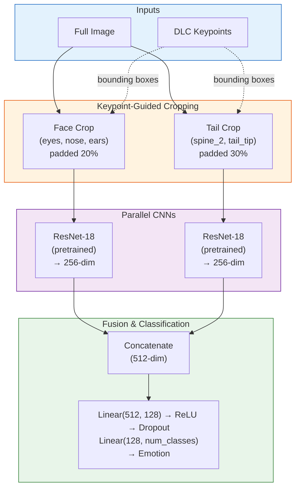

**Crop computation (pseudocode):**
```python
def get_face_crop(image, keypoints):
    face_kps = [right_eye, left_eye, nose, top_head, right_ear_base, left_ear_base]
    visible = [kp for kp in face_kps if not isnan(kp)]
    if len(visible) < 2:
        return None  # fallback to full image
    xs = [kp.x for kp in visible]
    ys = [kp.y for kp in visible]
    # Add 20% padding
    w, h = max(xs) - min(xs), max(ys) - min(ys)
    pad = max(w, h) * 0.2
    return image.crop(min(xs)-pad, min(ys)-pad, max(xs)+pad, max(ys)+pad)
```

**Data requirement:** ~500–1,000 labeled samples per class. Benefits from having high keypoint visibility (fewer NaN values = better crops).

**Strengths:**
- Forces the model to focus on micro-expressions: lip licking, whale eye, ear pinning, tail position
- Dramatically reduces background noise
- Smaller crop → smaller CNN → faster training
- Bridges keypoint precision with pixel richness

**Limitations:**
- **Fails on missing keypoints:** If face keypoints are all NaN, you can't compute a face crop. Need a fallback strategy (use full image, or skip that branch)
- **Tail often missing:** Tail may be out of frame, tucked, or occluded — the tail branch may not fire for many images
- **Crop quality depends on keypoint accuracy:** DLC errors propagate to bad crops
- **Two CNNs:** More compute than a single EfficientNet pass

---

## Phase 3: Hybrid Multimodal Architecture (State-of-the-Art)

### Architecture 5: Late-Fusion Multimodal Network

**Role:** The most powerful architecture — combines geometric precision of keypoints with the visual richness of raw images.

**Concept:** Two parallel branches extract features from different modalities, then a fusion network learns to combine them.

**Architecture:**

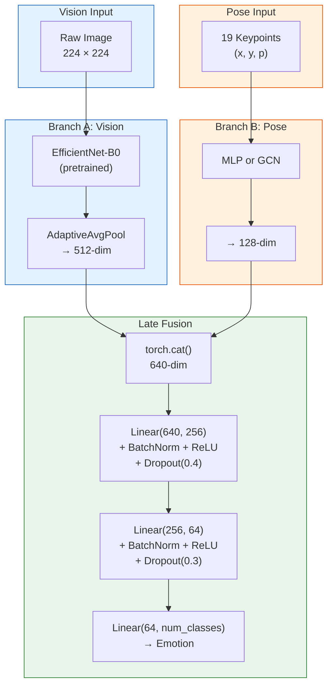

**Training strategy:**

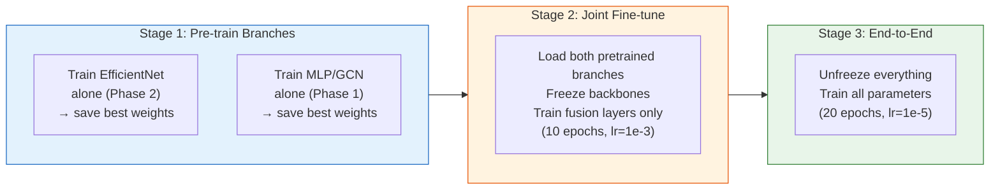

1. **Pre-train branches separately first:** Train the EfficientNet branch alone (Phase 2) and the MLP/GCN branch alone (Phase 1). Use their best weights as initialization.
2. **Joint fine-tuning:** Combine both branches, freeze the backbones, train only the fusion layers for 10 epochs.
3. **End-to-end:** Unfreeze everything, train with a very small learning rate (1e-5) for final refinement.

**Data requirement:** ~1,000+ labeled samples per class. The fusion layers need enough examples to learn meaningful cross-modal combinations.

**Strengths:**
- Best of both worlds: the pose branch provides exact joint angles and body posture, while the vision branch captures facial expressions, fur state, environmental context
- Can learn to dynamically weight modalities per emotion class (e.g., rely more on pose for "playful" but more on face pixels for "anxious")
- State-of-the-art approach in animal behavior classification literature
- The pre-trained branches give it a strong starting point even with moderate data

**Limitations:**
- Most complex to implement, train, and debug
- Risk of **branch dominance:** one branch may overpower the other (the vision branch typically dominates since images carry more raw information). Mitigation: gradient balancing, branch dropout, or separate learning rates
- Requires the most labeled data to justify the added complexity
- **Only build this after establishing Phase 1 and 2 baselines** — if EfficientNet alone hits 90%, the added complexity of fusion may not be worth it

**Variants to consider:**
- **Attention-based fusion:** Instead of simple concatenation, use a cross-attention mechanism where the pose features attend to vision features and vice versa. More expressive but harder to train.
- **Early fusion:** Overlay keypoint heatmaps directly onto the image as extra channels before feeding into a single CNN. Simpler than late fusion but less flexible.

---

## Recommended Build Order

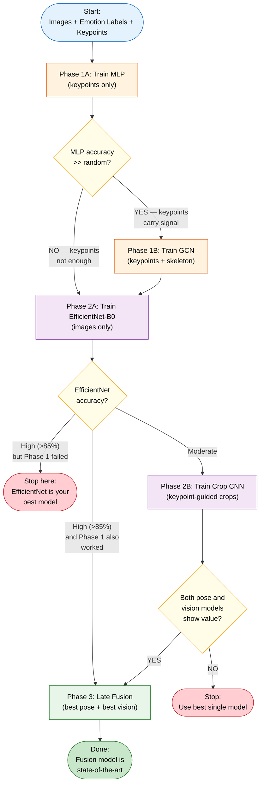

---

## Practical Limitations

### 1. Subjectivity of Animal Emotion
Dog emotions are inherently ambiguous — two experts may disagree on "anxious" vs. "alert" vs. "curious." This puts a ceiling on any model's accuracy. Mitigation: use clear behavioral definitions per class, have multiple annotators label a subset, and measure inter-annotator agreement. Your model cannot be more accurate than humans agree with each other.

### 2. Missing Keypoints (NaN Values)
The current `data.csv` has significant NaN gaps — many images are missing multiple keypoints due to occlusion, partial views, or DLC detection failures. Impact by architecture:

| Architecture | Impact of Missing Keypoints |
|---|---|
| MLP | Needs imputation (zero-fill + visibility mask recommended) |
| GCN | Broken graph edges — need to mask absent nodes or use partial convolutions |
| EfficientNet | No impact (doesn't use keypoints) |
| Crop CNN | Can't compute crops for missing regions — needs fallback to full image |
| Late Fusion | Pose branch degraded, vision branch unaffected — fusion must learn to down-weight noisy pose input |

### 3. Single-Frame vs. Temporal
Many emotions are expressed through **motion**, not static poses:
- Tail wagging speed and amplitude (happy vs. anxious tail wag)
- Body trembling or freezing
- Pacing or retreating
- Play bows (transient poses)

Single-frame models miss all of this. A dog mid-jump could be "playful" or "fearful" — only the temporal context disambiguates. Future extension: store keypoint sequences across consecutive frames and use ST-GCN or video transformers.

### 4. Dataset Bias
Images come from indoor dog cameras (Furbo) and YouTube compilations. Expected biases:
- Overrepresentation of relaxed/calm states (dogs spend most time resting)
- Indoor-only environments
- Limited breed diversity
- Specific camera angles (typically elevated, fixed-position)

The model may not generalize to outdoor dogs, different breeds, or different camera perspectives without additional diverse data.

### 5. Class Imbalance
Dog camera footage is naturally skewed — calm/neutral frames vastly outnumber aggressive or fearful moments. Mitigation strategies:
- Weighted loss function (higher weight for rare classes)
- Oversampling minority classes (SMOTE for keypoints, augmentation for images)
- Focal loss (automatically down-weights easy/frequent classes)
- Stratified train/test splits

### 6. DLC Keypoint Noise
DLC keypoint predictions are not ground truth — they carry their own prediction error. This noise propagates into all pose-based models. The confidence/likelihood score from DLC can help by allowing models to weight reliable keypoints higher than uncertain ones. **Action needed:** ensure the DLC inference pipeline preserves the confidence score alongside `(x, y)` in the training data.

---

## Summary Table

| Architecture | Input | Complexity | Min Data/Class | GPU Needed | Best For |
|---|---|---|---|---|---|
| **MLP** | Keypoints (57-dim) | Very Low | ~200–500 | No | Baseline, fast validation |
| **GCN** | Keypoints + skeleton | Low | ~200–500 | Optional | Spatial pose reasoning |
| **EfficientNet** | Raw images | Medium | ~500–1,000 | Yes | Best single-model accuracy |
| **Crop CNN** | Cropped images (via keypoints) | Medium | ~500–1,000 | Yes | Focused feature extraction |
| **Late Fusion** | Images + keypoints | High | ~1,000+ | Yes | State-of-the-art combined |

## Architecture Comparison: Complexity vs. Expected Accuracy

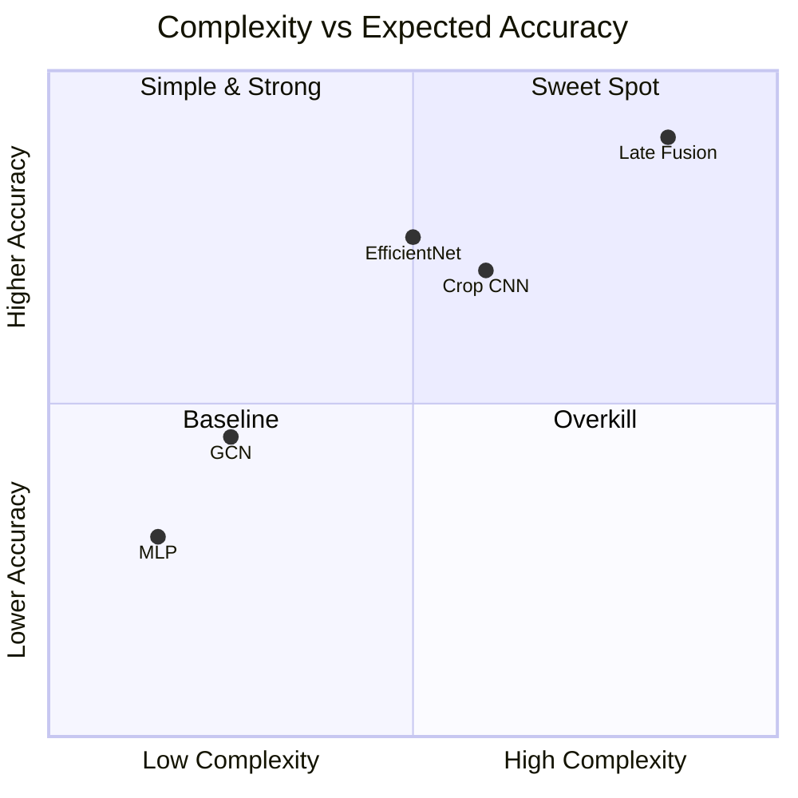

> **Note:** Accuracy values are illustrative estimates — actual performance depends on data quality, label consistency, and class count. The key insight is the diminishing returns: EfficientNet alone often gets you 80% of the way there, while Late Fusion adds significant complexity for a potentially modest accuracy boost.

## Data Flow: From Video to Emotion Prediction

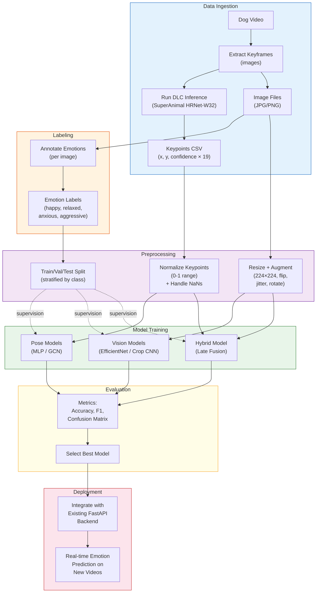

## What Each Phase Captures (Emotion Cues)

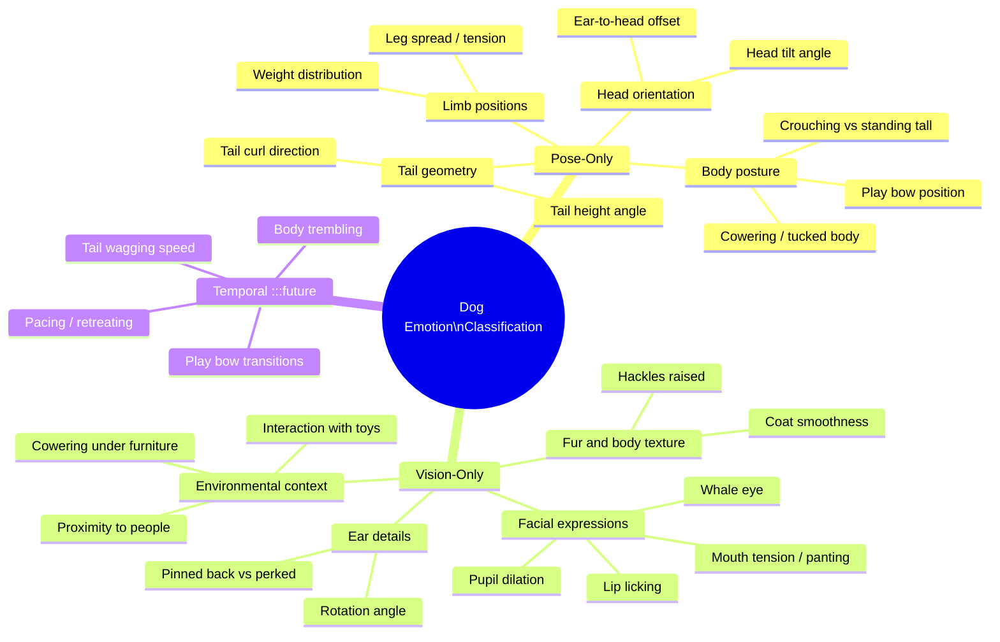

> **Note:** "Temporal" cues (in grey) require sequential frame data — not currently available but a valuable future extension via ST-GCN or video transformers.

---

## Tools & Dependencies

| Tool | Purpose | Install |
|------|---------|---------|
| PyTorch >= 2.0 | All architectures | `pip install torch torchvision` |
| PyTorch Geometric | GCN (Architecture 2) | `pip install torch-geometric` |
| torchvision | EfficientNet, ResNet pretrained weights | Included with PyTorch |
| scikit-learn | Metrics, train/test split, class weights | `pip install scikit-learn` |
| Weights & Biases or TensorBoard | Experiment tracking & comparison | `pip install wandb` |
| DeepLabCut >= 3.0 | Keypoint extraction from new videos | Already installed in project |
